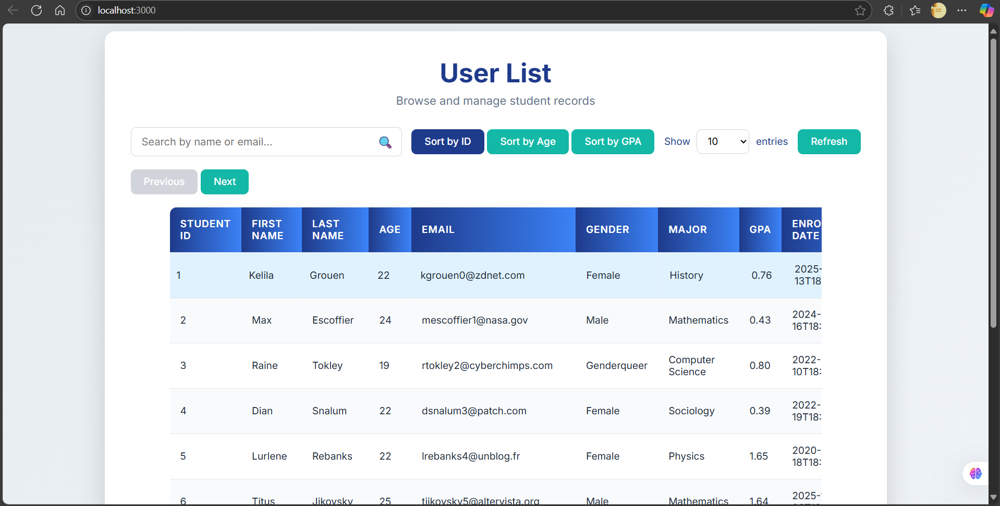
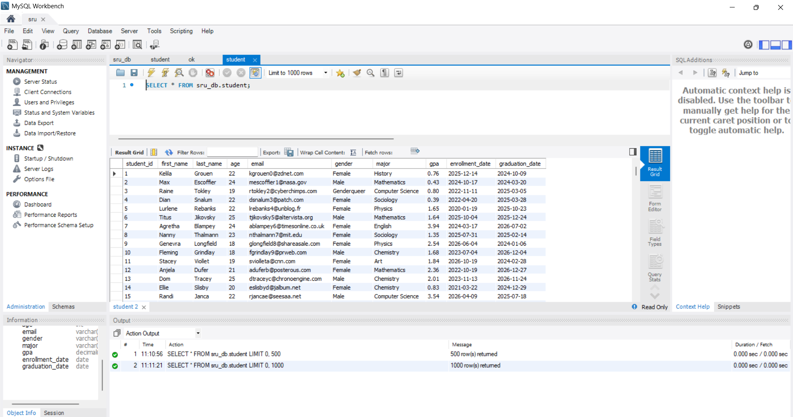

# User List App
 
# DB
.
A simple user list application built with Node.js, Express, and MySQL.

## 📁 File Structure
## User Listapp/
## ├── public/
## │   ├── app.html
## │   └── script.js
## ├── server.js
## ├── package.json
## ├── db/
## │   └── sru_db.sql
## ├── LICENSE
## └── README.md

## 📦 Setup Instructions
npm init -y

npm install express mysql2
--------------
open package.json
add line
npm install nodemon : ,"start": "nodemon server.js"
                        "main": "server.js"

change these for you quick start on runtime

## DATBASE:
## db\sru_db.sql
## Generated by https://www.mockaroo.com/.

## To start the server

npm start